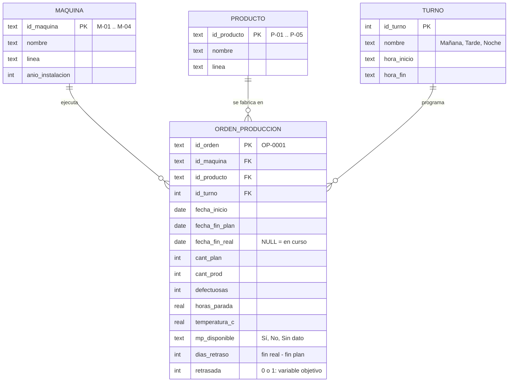
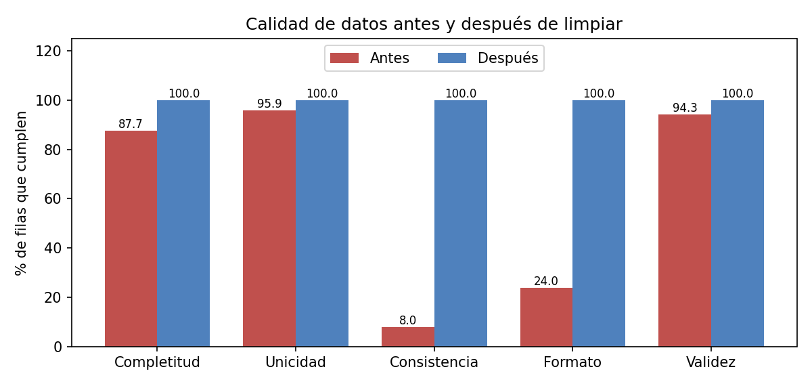
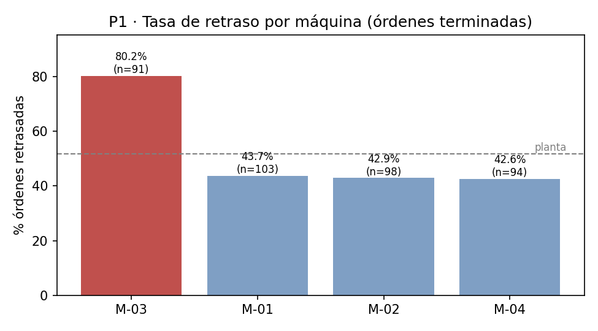
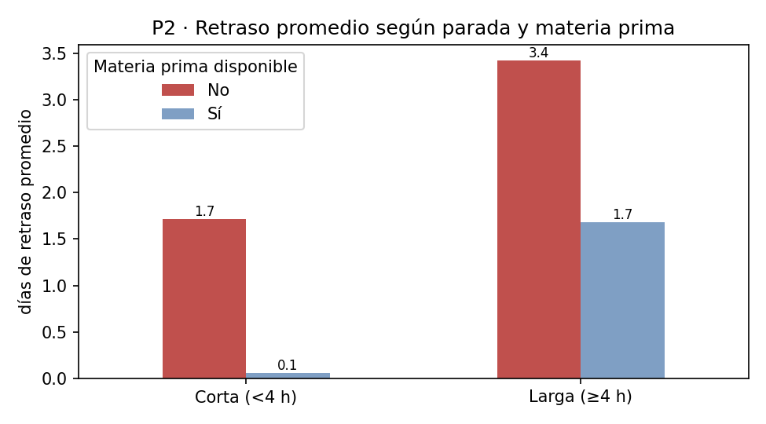

# Modelo, consulta y limpieza de datos — Órdenes de producción

**Actividad calificable · Corte 2 · Semana 9** — Ciencia de Datos · Ingeniería Industrial · CORHUILA 2026-B

| | |
|---|---|
| **Estudiante** | Nicol Alexandra Vargas Sánchez  |
| **Caso** | Predicción de retrasos en órdenes de producción (hilo conductor del Corte 1) |
| **Dataset** | `data/ordenes_produccion_raw.csv` — extracto sintético de un ERP (438 filas × 13 columnas) |

## Contenido de la carpeta

| Archivo | Para qué sirve |
|---|---|
| `README.md` | Este informe: ERD, limpieza antes/después, consultas y sección en inglés |
| `limpieza_consultas.ipynb` | Cuaderno ejecutado: carga, diagnóstico, limpieza paso a paso, consultas (pandas y SQL) |
| `esquema_produccion.sql` | DDL del modelo relacional (PK, FK y reglas `CHECK`) |
| `generar_datos.py` | Script (semilla fija) que genera el CSV sucio; permite reproducir todo |
| `data/ordenes_produccion_raw.csv` / `_clean.csv` | Datos originales y limpios |
| `data/normalizado/*.csv` | Las 4 tablas del ERD, listas para cargar a una base de datos |
| `img/*.png` | Gráficos del informe |

---

## 1. Diseño del ERD

Se parte de una sola tabla plana (el extracto del ERP) y se normaliza a **4 entidades**. Una máquina, un producto y un turno
se repiten en cientos de órdenes; separarlos evita repetir texto (y las variantes de escritura que ensuciaron el archivo).



| Relación | Cardinalidad | Lectura |
|---|---|---|
| MAQUINA — ORDEN_PRODUCCION | **1 : N** | Una máquina ejecuta muchas órdenes; cada orden se ejecuta en exactamente una máquina |
| PRODUCTO — ORDEN_PRODUCCION | **1 : N** | Un producto aparece en muchas órdenes; cada orden fabrica un solo producto |
| TURNO — ORDEN_PRODUCCION | **1 : N** | Un turno agrupa muchas órdenes; cada orden se asigna a un turno |

`ORDEN_PRODUCCION` es la entidad de hechos (lado "muchos" de las tres relaciones). `retrasada` y `dias_retraso` se derivan de las
fechas y son la variable objetivo del modelo predictivo del Corte 1. El DDL completo, con llaves foráneas y reglas de negocio
como `CHECK`, está en [`esquema_produccion.sql`](esquema_produccion.sql); el cuaderno lo ejecuta en SQLite para comprobar que los
datos limpios cumplen el modelo.

---

## 2. Limpieza de datos

**Reglas del negocio usadas para validar:** máximo 2 000 unidades por orden · defectuosas entre 0 y las producidas ·
sensor de temperatura de 15 a 60 °C · 4 máquinas, 5 productos y 3 turnos · el fin real no puede ser anterior al inicio.

### 2.1 Diagnóstico inicial (antes)

| Problema encontrado | Cantidad |
|---|---|
| Filas duplicadas exactas (copiar/pegar) | 18 |
| Nulos en `horas_parada` / `defectuosas` / `temperatura` / `mp_disponible` / `fecha_fin_real` | 22 / 13 / 12 / 10 / 11 |
| Formas distintas de escribir las 4 máquinas / 3 turnos / 5 productos | 24 / 18 / 25 |
| Fechas en `dd/mm/aaaa` (el resto en `aaaa-mm-dd`) | 225 celdas |
| Números con coma decimal (leídos como texto) | 321 celdas |
| Temperaturas en °F (valores > 60) | 14 |
| Valores imposibles: sobre capacidad / defectuosas > producidas / negativas / fin real antes del inicio | 2 / 3 / 2 / 5 |

### 2.2 Pasos aplicados (bitácora)

| Paso | Acción | Filas | Valores corregidos |
|---|---|---|---|
| 1 | Quitar duplicados exactos | 438 → 420 | — |
| 2 | Homologar máquina/producto/turno/materia prima (`strip`, mayúsculas, `M3` → `M-03`, `si`/`S` → `Sí`) | 420 | 386 |
| 3 | Texto → número (coma decimal) y texto → fecha (cada formato por separado, sin dejar que pandas adivine) | 420 | 530 |
| 4 | Lecturas °F → °C con `(F − 32) × 5/9`, solo en las filas marcadas | 420 | 13 |
| 5a | **Eliminar** filas sin `defectuosas` (rellenarla sería inventar defectos) | 420 → 407 | — |
| 5b | **Imputar** `horas_parada` y `temperatura` con la mediana de su máquina, marcando `*_imputada` | 407 | 34 |
| 6 | Eliminar valores imposibles (violan reglas del negocio) | 407 → 395 | — |

Decisiones sobre los vacíos restantes: `mp_disponible` vacío pasa a la categoría **`Sin dato`** (no se supone que hubo o no
materia prima) y `fecha_fin_real` vacía se **conserva** porque significa orden en curso (9 órdenes), no un error.
Las 20 paradas largas atípicas según IQR (límite 8,5 h; 18 son de la M-03) **no se eliminaron**: son posibles y son parte del hallazgo.

### 2.3 Resultado: antes vs. después

Cada dimensión es el % de filas que la cumplen, medido con la misma función antes y después.

| Dimensión | Antes | Después |
|---|---|---|
| Completitud (sin vacíos en columnas obligatorias) | 87,7 % | 100 % |
| Unicidad (sin filas ni órdenes repetidas) | 95,9 % | 100 % |
| Consistencia (valores iguales al catálogo oficial) | 8,0 % | 100 % |
| Formato (fechas `aaaa-mm-dd`, números sin coma) | 24,0 % | 100 % |
| Validez (reglas del negocio) | 94,3 % | 100 % |

| Métrica | Antes | Después |
|---|---|---|
| Filas | 438 | 395 |
| Tipos | 10 columnas de texto | fechas como `datetime`, números como `float`/`int` |
| "Máquinas" distintas en la tabla | 24 | 4 |



> La consistencia parte tan baja porque la fila solo cumple si **las cuatro** columnas de catálogo están bien escritas a la vez.

---

## 3. Dos preguntas con consultas

Ambas se resolvieron con pandas **y** con SQL sobre las tablas normalizadas, y el cuaderno comprueba que dan el mismo resultado.

### Pregunta 1 — ¿Qué máquina concentra más retrasos?

*Filtro:* órdenes terminadas (`fecha_fin_real IS NOT NULL`, 386). *Agregación:* % retrasadas y días de retraso promedio por máquina.

```sql
SELECT m.id_maquina, m.nombre, m.anio_instalacion,
       COUNT(*) AS ordenes, SUM(o.retrasada) AS retrasadas,
       ROUND(100.0 * AVG(o.retrasada), 1) AS pct_retrasadas,
       ROUND(AVG(o.dias_retraso), 2)      AS dias_retraso_prom
FROM orden_produccion o
JOIN maquina m ON m.id_maquina = o.id_maquina
WHERE o.fecha_fin_real IS NOT NULL
GROUP BY m.id_maquina
ORDER BY pct_retrasadas DESC;
```

| Máquina | Año | Órdenes | % retrasadas | Días de retraso (prom.) |
|---|---|---|---|---|
| **M-03 Selladora C** | 2012 | 91 | **80,2 %** | **1,89** |
| M-01 Extrusora A | 2019 | 103 | 43,7 % | 0,42 |
| M-02 Extrusora B | 2021 | 98 | 42,9 % | 0,44 |
| M-04 Cortadora D | 2023 | 94 | 42,6 % | 0,32 |



**Hallazgo.** La M-03, la máquina más antigua, retrasa el 80,2 % de sus órdenes frente al 43,1 % de las otras tres juntas
(promedio de planta: 51,8 %) y acumula más de cuatro veces los días de atraso por orden de cualquiera de las otras. Sin limpiar, la misma consulta
repartía las órdenes en 24 "máquinas" (la mayor con 74 órdenes) y mostraba grupos de 2 o 3 órdenes con 100 % de retraso: una
decisión de mantenimiento basada en eso habría apuntado a la máquina equivocada. Conviene priorizar la M-03 en el plan de mantenimiento.

### Pregunta 2 — ¿Cuánto pesan la falta de materia prima y las paradas largas?

*Filtro:* órdenes terminadas con materia prima conocida (se excluye `Sin dato`). *Agregación:* retraso promedio y % retrasadas por
combinación de materia prima (Sí/No) y parada (< 4 h / ≥ 4 h).

```sql
SELECT o.mp_disponible,
       CASE WHEN o.horas_parada >= 4 THEN 'Larga (≥4 h)' ELSE 'Corta (<4 h)' END AS parada,
       COUNT(*) AS ordenes,
       ROUND(100.0 * AVG(o.retrasada), 1) AS pct_retrasadas,
       ROUND(AVG(o.dias_retraso), 2)      AS dias_retraso_prom
FROM orden_produccion o
WHERE o.fecha_fin_real IS NOT NULL AND o.mp_disponible <> 'Sin dato'
GROUP BY o.mp_disponible, parada;
```

| Materia prima | Parada | Órdenes | % retrasadas | Días de retraso (prom.) |
|---|---|---|---|---|
| Sí | Corta (< 4 h) | 239 | 33,5 % | 0,06 |
| Sí | Larga (≥ 4 h) | 79 | 79,7 % | 1,68 |
| No | Corta (< 4 h) | 41 | 85,4 % | 1,71 |
| No | Larga (≥ 4 h) | 19 | 94,7 % | **3,42** |



**Hallazgo.** Los dos factores se **suman**: con materia prima y paradas cortas la orden prácticamente sale a tiempo (0,06 días),
con uno de los dos problemas se atrasa cerca de 1,7 días y con ambos casi 3,4 días. Sin materia prima el retraso promedio es de
2,2 días contra 0,5 días con materia prima. Son dos palancas preventivas concretas (asegurar el abastecimiento y reducir paradas)
para el modelo de riesgo del Corte 1.

**Limitaciones.** (a) El dataset es sintético: el patrón se diseñó para ilustrar el método, por lo que los hallazgos
no describen una planta real. (b) Las paradas largas se concentran en la M-03 (53 de las 98 órdenes con parada ≥ 4 h), así que
las preguntas 1 y 2 no son independientes. (c) Es una asociación, no una prueba de causalidad.

---

## 4. Data & cleaning (English)

This project uses a synthetic extract of a plant's ERP with 438 production orders, each described by 13 columns such as machine, product, shift, planned and actual finish dates, units produced, defects, downtime hours, temperature and raw-material availability. I generated it with a fixed random seed to mimic three supervisors typing data by hand, so it contains the usual quality problems of a real log. Before cleaning, it had 18 duplicated rows, 24 different spellings of the 4 machine codes, dates in two formats, decimal commas that turned numbers into text, 14 temperatures recorded in Fahrenheit, 68 missing values spread across five columns, and 12 impossible records such as negative defects or a finish date earlier than the start date. I cleaned a working copy in six logged steps: removing duplicates, standardizing text to the official catalogs, converting types, converting °F to °C, handling missing values, and dropping impossible rows. Missing defects were deleted because filling them would invent data, while downtime and temperature were imputed with each machine's median and flagged; the order count went from 438 to 395 and the five quality dimensions rose from between 8% and 95.9% to 100%. The first question asked which machine has the highest delay rate, and the answer was machine M-03, the oldest one, with 80.2% of delayed orders against 43.1% for the other three machines combined. The second question asked how raw-material shortages and long downtimes affect delays, and orders with both problems were late by 3.4 days on average, compared with only 0.06 days for orders with neither. These findings come from synthetic data and show association, not causation, but they demonstrate how clean data leads to a reliable maintenance and supply decision.

---

## 5. Cómo reproducir

```bash
pip install pandas matplotlib nbformat nbclient ipykernel
python generar_datos.py          # regenera data/ordenes_produccion_raw.csv
jupyter nbconvert --to notebook --execute --inplace limpieza_consultas.ipynb
```

> **Nota de entrega:** copia esta carpeta como `09-week/` dentro de tu fork del repositorio de la clase y sube con
> `git add .`, `git commit -m "Entrega semana 09"`, `git push`, siguiendo el Manual de Entrega por GitHub. Verifica que tu repo de perfil tenga el bloque
> `CONFIG` con `FULL_NAME` y `GITHUB_USER`.
